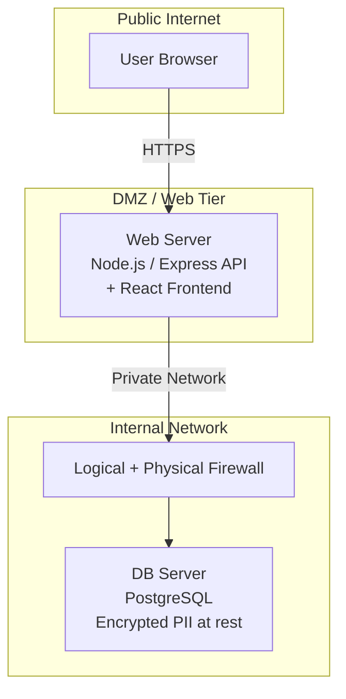
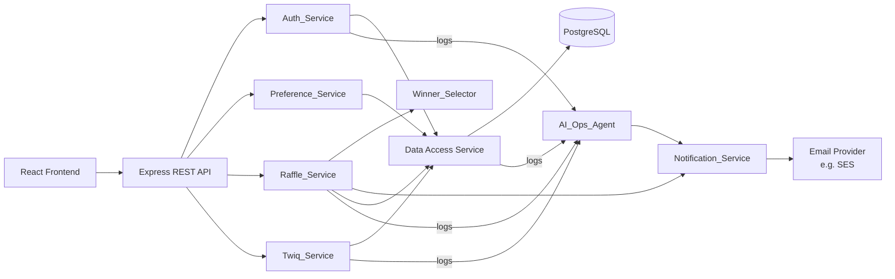
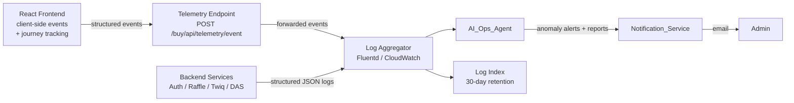
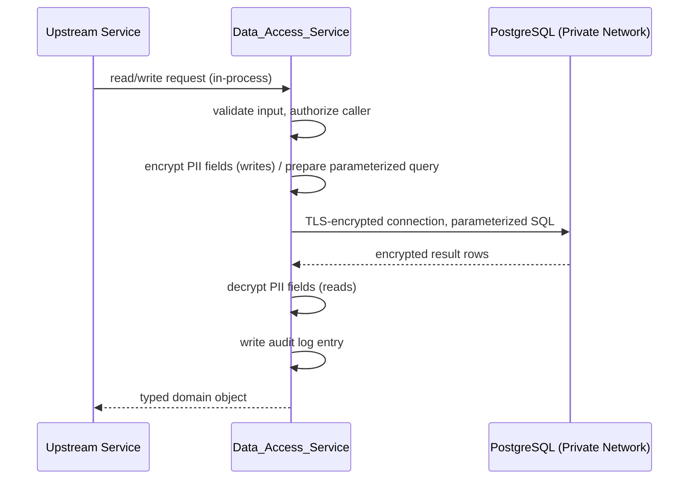

# Design Document: Twiqit Alpha — E-Commerce Platform

## Overview

Twiqit Alpha is a single-item raffle-based e-commerce platform (Woot-style) built by Desert Bay, LLC. Users earn Twiqs (virtual currency) by watching ads and spend them bidding on a single featured item (the "Drop"). A raffle mechanic determines the winner. The admin exclusively manages raffles. The platform prioritizes security, performance, and a clean UX.

### Key Design Goals

- Entire platform lives at `twiqit.com/buy` — the main Twiqit landing page (`/`) is not modified
- One active Drop at a time — focused, simple UX
- Twiq economy: earn via qualifying actions, spend on bids, cash out via payment handle (Venmo stub in Alpha)
- Raffle lifecycle: creation → bidding → expiration → winner selection → notification
- Admin-only raffle management with no user-facing raffle controls
- Loosely coupled Winner_Selector for algorithm replaceability
- Separate web/DB infrastructure with encrypted PII at rest
- `/buy` homepage < 2s, bid acknowledgement < 1s

---

## Architecture

The system follows a three-tier architecture with strict separation between the web tier and data tier for security.



- The Web_Server is the only publicly reachable component.
- The DB_Server sits behind both a logical firewall (e.g., security group / iptables) and a physical firewall, with no direct public internet access.
- All PII fields (email, venmo handle) are encrypted at rest in the DB.
- Sessions are managed via signed JWTs with short expiry + refresh tokens.
- No upstream service (Auth, Preference, Raffle, Twiq) accesses PostgreSQL directly — all DB operations are proxied through the Data_Access_Service.

### Routing and Mount Point

The Twiqit Alpha platform is mounted as a sub-application at `/buy` within the existing Express server (`index.js`). The main landing page at `/` and the `/Sam` route are not modified.

```
/                        → existing Twiqit landing page (unchanged)
/Sam                     → existing Sam page (unchanged)
/buy                     → Twiqit Alpha React app (SPA entry point)
/commerce                → alias for /buy (redirect 301 → /buy)
/buy/api/auth/...        → Auth_Service routes
/buy/api/twiqs/...       → Twiq_Service routes
/buy/api/raffle/...      → Raffle_Service routes
/buy/api/user/...        → Preference_Service routes
/buy/api/admin/...       → Admin routes (raffle management)
/buy/api/telemetry/...   → Telemetry endpoint (AI_Ops_Agent feed)
```

The React frontend is served as a static SPA from `/buy`, with all client-side routes prefixed under `/buy`. The existing `public/` directory and `index.js` server are extended minimally — only a new static mount and API router are added.




---

## Components and Interfaces

### Data_Access_Service

The single proxy between all upstream services and PostgreSQL. No service accesses the database directly — all reads and writes go through the Data_Access_Service. This centralizes connection pooling, query logic, encryption/decryption of PII fields, and audit logging of data operations.

```typescript
interface DataAccessService {
  // Users
  createUser(data: CreateUserInput): Promise<User>;
  getUserById(id: string): Promise<User | null>;
  getUserByEmail(email: string): Promise<User | null>;
  getUserByGoogleId(googleId: string): Promise<User | null>;
  updateUser(id: string, data: Partial<User>): Promise<User>;

  // Twiqs
  getTwiqBalance(userId: string): Promise<number>;
  createTwiqTransaction(data: CreateTwiqTransactionInput): Promise<TwiqTransaction>;
  getLastAdWatchTime(userId: string): Promise<Date | null>;

  // Raffles
  createRaffle(data: CreateRaffleInput): Promise<Raffle>;
  getActiveRaffle(): Promise<Raffle | null>;
  getRaffleById(id: string): Promise<Raffle | null>;
  updateRaffle(id: string, data: Partial<Raffle>): Promise<Raffle>;

  // Drops
  getDropById(id: string): Promise<Drop | null>;

  // Bids
  createBidEntry(data: CreateBidEntryInput): Promise<BidEntry>;
  getBidEntriesByRaffleId(raffleId: string): Promise<BidEntry[]>;

  // Password Reset — not applicable in Alpha (Google OAuth only)
}
```

### Auth_Service

Handles authentication exclusively via Google OAuth 2.0. No password storage or reset flow exists in Alpha.

```
GET  /buy/api/auth/google             — redirect to Google OAuth consent screen
GET  /buy/api/auth/google/callback    — handle OAuth callback, create/retrieve user, return session token
POST /buy/api/auth/logout             — invalidate session
```

On first sign-in, the Auth_Service creates a User record using the verified email and display name from Google's ID token. On subsequent sign-ins it retrieves the existing record. Sessions are managed via signed JWTs (short expiry + refresh token).

### Preference_Service

Handles authenticated user profile updates.

```
PUT  /buy/api/user/payment-handle    — save Venmo handle to user profile
GET  /buy/api/user/profile        — retrieve profile (non-sensitive fields)
```

### Twiq_Service

Manages Twiq balance, ad-watch crediting, and cash-out.

```
POST /buy/api/twiqs/watch-ad      — credit 100 Twiqs (enforces 24h cooldown)
GET  /buy/api/twiqs/balance       — return current balance
POST /buy/api/twiqs/cashout       — log cashout intent (stubbed, no live payment)
```

### Raffle_Service

Core raffle lifecycle management. Admin-only mutation endpoints.

```
POST   /buy/api/admin/raffle              — create new raffle (admin only)
PUT    /buy/api/admin/raffle/:id          — update active raffle (admin only)
POST   /buy/api/admin/raffle/:id/replace  — close current, create new (admin only)
GET    /buy/api/raffle/active             — get current active raffle + drop details
POST   /buy/api/raffle/:id/bid            — submit a bid (authenticated users)
POST   /buy/api/raffle/:id/confirm-receipt — winner confirms item receipt
```

### Winner_Selector

A loosely coupled component invoked by Raffle_Service when a raffle closes with sufficient participation. The interface is a single function:

```typescript
interface WinnerSelector {
  selectWinner(bidEntries: BidEntry[]): BidEntry;
}
```

The default implementation uses a cryptographically seeded random index. The implementation can be swapped without modifying Raffle_Service — only the injected dependency changes.

### Notification_Service

Sends transactional emails via a pluggable email provider.

```typescript
interface NotificationService {
  sendWinnerNotification(user: User, raffle: Raffle): Promise<void>;
  sendCashoutFailure(user: User, reason: string): Promise<void>;
  sendAdCooldownNotice(user: User, eligibleAt: Date): Promise<void>;
  sendAdminRaffleUnderThreshold(admin: User, raffle: Raffle): Promise<void>;
}
```

### AI_Ops_Agent

An autonomous AI agent that runs as a background process, continuously tailing application and server logs, detecting anomalies, and generating operational reports for the Admin.

#### Responsibilities

- Real-time log ingestion and classification (info / warning / error / critical)
- Anomaly detection: error rate spikes, latency degradation, repeated failed auth, unusual bid/Twiq patterns
- Scheduled report generation (configurable interval, default daily)
- Alert delivery via Notification_Service when anomalies are detected
- Watchdog self-monitoring — emits a fallback alert if the agent goes silent

#### Architecture

The AI_Ops_Agent runs as a separate process on the Web_Server tier. It ingests from two log streams:

1. **Backend log stream** — all server-side services (Auth, Raffle, Twiq, DAS) write structured JSON logs to stdout, collected by a log aggregator (e.g. Fluentd or a cloud-native equivalent).
2. **Frontend event stream** — the React frontend emits structured client-side events (page views, user interactions, journey steps, JS errors) to a lightweight telemetry endpoint on the API, which forwards them into the same log aggregator pipeline.

The agent does not have write access to the database — it is read-only with respect to logs and metrics.



#### Agent Behavior

The agent operates in two modes:

**Continuous monitoring** — processes each log event as it arrives, applies anomaly detection rules, and triggers an alert if thresholds are breached:

| Signal | Threshold | Severity |
|--------|-----------|----------|
| HTTP 5xx rate | > 1% of requests in a 5-min window | Error |
| API p99 latency | > 2× baseline for 5 consecutive minutes | Warning |
| Failed auth attempts | > 20 from a single IP in 10 minutes | Critical |
| Bid submission errors | > 5% of bids in a 5-min window | Warning |
| Data_Access_Service errors | any DB connection failure | Critical |
| Frontend JS errors | > 10 unique errors in a 5-min window | Warning |
| Checkout drop-off rate | > 30% abandonment at bid step vs. baseline | Warning |
| Homepage bounce rate | > 2× baseline in a 10-min window | Warning |
| Ad watch completion rate | < 50% completion in a 30-min window | Warning |
| User journey stall | user inactive mid-flow for > 5 min (repeated pattern) | Info |

**Scheduled reporting** — at the configured interval, the agent compiles a structured report covering:
- Request volume and error rates by endpoint
- p50 / p95 / p99 latency
- Active raffle status and Twiq transaction volume
- Failed login attempt summary
- Frontend JS error summary
- User journey funnel: registration → ad watch → bid → raffle close (conversion rates per step)
- Ad watch completion rate
- Top drop-off points in the user journey
- Anomalies detected since last report
- Agent health status

#### Interface

```typescript
interface AIOpsAgent {
  start(): void;
  stop(): void;
  getStatus(): AgentStatus;
  generateReport(from: Date, to: Date): Promise<OperationalReport>;
}

interface OperationalReport {
  generatedAt: Date;
  period: { from: Date; to: Date };
  errorRates: Record<string, number>;
  latencyPercentiles: { p50: number; p95: number; p99: number };
  twiqTransactionVolume: number;
  failedLoginAttempts: number;
  frontendErrorSummary: { errorType: string; count: number }[];
  journeyFunnel: {
    registered: number;
    watchedAd: number;
    placedBid: number;
    wonRaffle: number;
  };
  adWatchCompletionRate: number;   // 0–1
  topDropOffPoints: { step: string; dropOffRate: number }[];
  anomalies: AnomalyEvent[];
  agentHealthy: boolean;
}
```

---

## Data Security

This section describes how every read and write to PostgreSQL is secured end-to-end, covering transport, access control, encryption, and auditability.

### 1. Network Isolation

The DB_Server has no public IP and is not reachable from the internet. Only the Web_Server (on the same private network) can initiate a connection, enforced by both a physical firewall and a logical firewall (OS-level iptables / cloud security group). PostgreSQL listens only on the private network interface, not `0.0.0.0`.

### 2. Encrypted Transport (TLS)

All connections from the Data_Access_Service to PostgreSQL use TLS (`sslmode=require`). Plaintext connections are rejected at the PostgreSQL configuration level (`ssl = on`, `ssl_min_protocol_version = TLSv1.2`). This ensures data in transit between the web tier and DB tier cannot be intercepted even on the private network.

### 3. Least-Privilege DB Credentials

The Data_Access_Service connects to PostgreSQL using a dedicated application role (`twiqit_app`) that has only the minimum required privileges:

| Privilege | Tables |
|-----------|--------|
| SELECT, INSERT, UPDATE | users, raffles, drops, bid_entries, twiq_transactions, password_reset_tokens |
| SELECT only | (read-only views for analytics) |
| No DROP, TRUNCATE, ALTER, or schema-level access | all tables |

No service or developer credential has direct write access to the DB from outside the private network. Admin DB access (migrations, maintenance) requires a separate privileged role used only via a bastion host with MFA.

### 4. Application-Level PII Encryption

PII fields are encrypted by the Data_Access_Service before being written to PostgreSQL, and decrypted after being read — the database never stores plaintext PII. PostgreSQL-level encryption at rest (transparent data encryption or filesystem encryption) provides a second layer.

| Field | Encryption |
|-------|-----------|
| `users.email` | AES-256-GCM, app-managed key |
| `users.venmoHandle` | AES-256-GCM, app-managed key |
| All other fields | Stored plaintext (non-PII) |

Encryption keys are stored in a secrets manager (e.g., AWS Secrets Manager or HashiCorp Vault) and are never hardcoded or committed to source control. Key rotation is supported without downtime via a versioned key envelope scheme.

### 5. Parameterized Queries (SQL Injection Prevention)

The Data_Access_Service uses a query builder or ORM (e.g., `pg` with parameterized queries, or Prisma) exclusively. Raw string interpolation into SQL is prohibited. All user-supplied values are passed as bound parameters, making SQL injection structurally impossible at the data access layer.

### 6. Read/Write Audit Log

Every call to the Data_Access_Service is logged with:
- Timestamp
- Operation type (read / write)
- Table and record ID affected
- Calling service identity
- Success or failure

Audit logs are append-only, written to a separate log store that the application role cannot modify or delete. This provides a full chain of custody for every data operation.

### 7. Transaction Integrity

All multi-step write operations (e.g., deducting Twiqs and recording a bid entry) are executed within a single PostgreSQL transaction. If any step fails, the entire transaction is rolled back, preventing partial writes and balance inconsistencies.

### Data Security Flow Summary



---

## Data Models

```typescript
interface User {
  id: string;                    // UUID
  googleId: string;              // Google OAuth subject identifier
  email: string;                 // encrypted at rest
  displayName: string;           // from Google profile
  isAdmin: boolean;
  twiqBalance: number;           // integer, non-negative
  venmoHandle: string | null;     // encrypted at rest
  lastAdWatchedAt: Date | null;
  createdAt: Date;
}
```

### Raffle

```typescript
interface Raffle {
  id: string;                    // UUID
  dropId: string;                // FK to Drop
  status: 'active' | 'closed' | 'winner_selected' | 'receipt_confirmed' | 'no_winner';
  minTwiqThreshold: number;      // minimum total bids to select a winner
  maxTwiqThreshold: number;      // total bids that trigger immediate close
  expiresAt: Date;               // time-based expiration
  totalTwiqsBid: number;         // running total
  winnerId: string | null;       // FK to User
  winningBidId: string | null;   // FK to BidEntry
  createdAt: Date;
  closedAt: Date | null;
}
```

### Drop

```typescript
interface Drop {
  id: string;                    // UUID
  name: string;
  description: string;
  imageUrl: string;
  retailValue: number;           // in cents
  createdAt: Date;
}
```

### BidEntry

```typescript
interface BidEntry {
  id: string;                    // UUID
  raffleId: string;              // FK to Raffle
  userId: string;                // FK to User
  twiqAmount: number;            // amount bid
  createdAt: Date;
}
```

### TwiqTransaction

```typescript
interface TwiqTransaction {
  id: string;                    // UUID
  userId: string;                // FK to User
  type: 'ad_watch' | 'bid' | 'cashout' | 'cashout_reversal';
  amount: number;                // positive = credit, negative = debit
  referenceId: string | null;    // e.g. raffleId, bidEntryId
  createdAt: Date;
}
```

### PasswordResetToken

Not applicable in Alpha — authentication is exclusively via Google OAuth. No password storage or reset tokens exist.

---

## Correctness Properties

*A property is a characteristic or behavior that should hold true across all valid executions of a system — essentially, a formal statement about what the system should do. Properties serve as the bridge between human-readable specifications and machine-verifiable correctness guarantees.*


### Property 1: At most one active Drop at any time

*For any* sequence of raffle creation and replacement operations, the count of raffles with status `active` in the system should never exceed 1.

**Validates: Requirements 1.1**

---

### Property 2: Ad watch credits exactly 100 Twiqs

*For any* eligible user (last ad watch > 24 hours ago or never), watching an ad should increase their Twiq balance by exactly 100 and no more.

**Validates: Requirements 2.2**

---

### Property 3: Ad watch 24-hour cooldown enforcement

*For any* user who has already watched an ad within the last 24 hours, a subsequent ad-watch request should be rejected and the user's balance should remain unchanged.

**Validates: Requirements 2.3, 2.4**

---

### Property 4: Cashout balance invariant

*For any* user with a stored bank account, a successful cashout should reduce the user's Twiq balance by the requested amount; a failed cashout should leave the balance completely unchanged.

**Validates: Requirements 2.6, 2.7**

---

### Property 5: Bid deduction and recording

*For any* authenticated user with sufficient Twiq balance bidding on an active raffle, the bid should be recorded in the raffle's entries and the user's balance should decrease by exactly the bid amount. For any bid where the user's balance is less than the bid amount, the bid should be rejected and the balance unchanged.

**Validates: Requirements 3.1, 3.2**

---

### Property 6: Closed raffle rejects bids

*For any* raffle with a status other than `active`, any bid submission attempt should be rejected.

**Validates: Requirements 3.4**

---

### Property 7: Non-admin raffle management denial

*For any* user where `isAdmin` is false, any raffle creation, update, or replacement request should be denied with an authorization error.

**Validates: Requirements 4.1, 4.5**

---

### Property 8: Raffle creation requires all threshold fields

*For any* raffle creation request missing one or more of `minTwiqThreshold`, `maxTwiqThreshold`, or `expiresAt`, the system should reject the request.

**Validates: Requirements 4.2**

---

### Property 9: Raffle update preserves bid entries

*For any* active raffle with existing bid entries, updating the raffle's configuration should leave the set of bid entries identical to what it was before the update.

**Validates: Requirements 4.3**

---

### Property 10: Raffle replacement closes old and opens new

*For any* active raffle, when an admin replaces it, the old raffle's status should become `closed` and exactly one new raffle with status `active` should exist.

**Validates: Requirements 4.4**

---

### Property 11: Max threshold triggers immediate close

*For any* raffle where `totalTwiqsBid` reaches or exceeds `maxTwiqThreshold`, the raffle status should transition to `closed` and winner selection should be triggered.

**Validates: Requirements 5.1**

---

### Property 12: Time expiration triggers close

*For any* raffle whose `expiresAt` time has passed and whose `totalTwiqsBid` >= `minTwiqThreshold`, the raffle should be closed and winner selection triggered.

**Validates: Requirements 5.2**

---

### Property 13: Under-threshold expiration yields no winner

*For any* raffle whose `expiresAt` time has passed and whose `totalTwiqsBid` < `minTwiqThreshold`, the raffle status should be set to `no_winner` and the admin should be notified.

**Validates: Requirements 5.3**

---

### Property 14: Winner is always a valid bid entry

*For any* raffle that closes with sufficient participation, the selected winner must be one of the existing bid entries for that raffle, and the winner must be recorded on the raffle record.

**Validates: Requirements 6.1, 6.3**

---

### Property 15: Winner notification is sent

*For any* raffle where a winner is selected, the notification service should be invoked with the winning user's information.

**Validates: Requirements 7.1**

---

### Property 16: Receipt confirmation updates raffle status

*For any* raffle with a selected winner, when the winning user confirms receipt, the raffle status should transition to `receipt_confirmed`.

**Validates: Requirements 7.2**

---

### Property 17: Google OAuth sign-in creates or retrieves user

*For any* valid Google OAuth callback with a unique `googleId`, the system should either create a new User record (first sign-in) or retrieve the existing one (returning user), and return a valid session token in both cases.

**Validates: Requirements 8.2, 8.3**

---

### Property 18: Payment handle update persists

*For any* authenticated user, updating their Venmo handle and then retrieving their profile should return the updated handle value.

**Validates: Requirements 8.5**

---

## Error Handling

### Twiq Operations
- Insufficient balance on bid → HTTP 422, message: "Insufficient Twiq balance"
- Ad watch within cooldown → HTTP 429, message: "Ad already watched. Eligible again at {time}"
- Cashout failure (no handle set) → HTTP 422, balance unchanged, user prompted to set payment handle

### Raffle Operations
- Bid on inactive raffle → HTTP 409, message: "Raffle is no longer active"
- Non-admin raffle management → HTTP 403, message: "Unauthorized"
- Missing required raffle fields → HTTP 400, message: "minTwiqThreshold, maxTwiqThreshold, and expiresAt are required"

### Auth Operations
- Google OAuth failure or denial → HTTP 401, message: "Authentication failed. Please try signing in with Google again."
- Duplicate Google account conflict → handled transparently (existing account retrieved, no error)

### General
- All unhandled errors return HTTP 500 with a generic message; full error details are logged server-side only
- All error responses follow a consistent shape: `{ "error": { "code": string, "message": string } }`

---

## Testing Strategy

### Dual Testing Approach

Both unit tests and property-based tests are required. They are complementary:
- Unit tests catch concrete bugs at specific examples and integration points
- Property tests verify universal correctness across all inputs

### Property-Based Testing

**Library**: [fast-check](https://github.com/dubzzz/fast-check) (TypeScript/JavaScript)

Each property test must:
- Run a minimum of **100 iterations**
- Be tagged with a comment referencing the design property:
  `// Feature: ecommerce-platform, Property {N}: {property_text}`
- Cover exactly one correctness property from this document

Example:
```typescript
// Feature: ecommerce-platform, Property 3: Ad watch 24-hour cooldown enforcement
it('rejects ad watch within 24h cooldown', () => {
  fc.assert(
    fc.property(fc.record({ userId: fc.uuid(), lastWatchedAt: fc.date({ max: new Date() }) }), (user) => {
      const result = twiqService.watchAd(user);
      expect(result.success).toBe(false);
      expect(result.balanceDelta).toBe(0);
    }),
    { numRuns: 100 }
  );
});
```

### Unit Testing

Unit tests focus on:
- Specific examples demonstrating correct behavior (e.g., exact 100 Twiq credit)
- Integration points between services (e.g., Raffle_Service invoking Winner_Selector)
- Edge cases: expired tokens, zero-balance users, raffle at exact threshold boundary
- Error condition responses (correct HTTP status codes and message shapes)

Avoid writing unit tests that duplicate what property tests already cover broadly.

### Test Coverage Targets

| Area | Approach |
|------|----------|
| Twiq crediting / cooldown | Property tests (Properties 2, 3) |
| Bid deduction / rejection | Property tests (Properties 5, 6) |
| Raffle lifecycle transitions | Property tests (Properties 10, 11, 12, 13) |
| Winner selection validity | Property test (Property 14) |
| Auth round trip | Property test (Property 17) |
| Admin authorization | Property test (Property 7) |
| Performance (homepage < 2s, bid < 1s) | Load testing (k6 or Artillery) — separate from unit/property tests |
| Infrastructure security | Manual audit + penetration testing |
